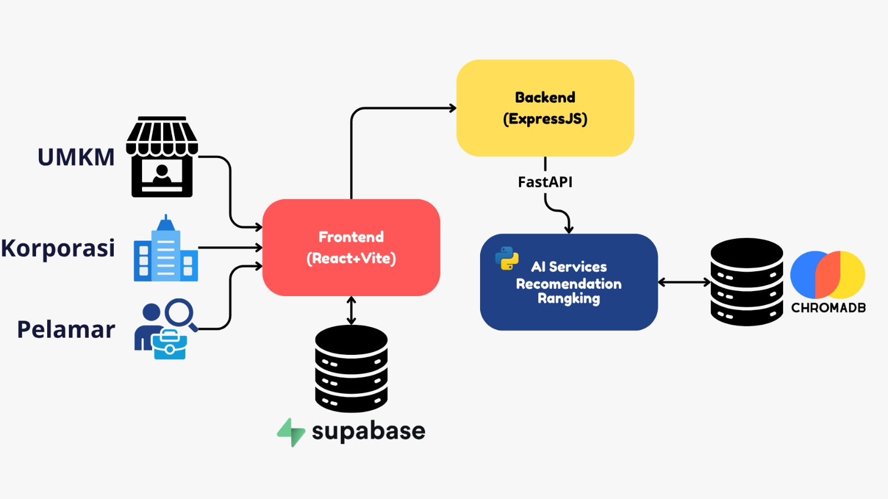

# Rekrutrek — Platform Rekrutmen UMKM & Korporat
**Capstone Project CC26-PSU370 | Coding Camp 2026 × DBS Foundation**

## Deskripsi Proyek

Rekrutrek adalah platform pencari kerja dan rekrutmen berbasis AI untuk UMKM dan korporat. Proyek ini dikembangkan sebagai bagian dari Capstone Project di program Coding Camp DBS Foundation 2026. Proyek ini merevolusi proses rekrutmen agar cerdas, cepat, dan tepat sasaran. Diotomatisasi dengan AI, platform ini menyediakan fitur Fast Matching untuk pencocokan lowongan secara cepat, dan fitur Rangking Kandidat untuk membantu proses perekrutan bagi perusahaan.

## Fitur Utama

* ⚡ **Fast Matching:** Pendaftaran instan tanpa dokumen CV untuk pekerja sektor informal atau UMKM berdasarkan kesesuaian jarak dan ekspektasi gaji.
* 🤖 **Rekomendasi Cerdas (AI):** Sistem mencocokan profil pelamar dan kriteria lowongan secara akurat menggunakan arsitektur *Two-Tower Neural Network*.
* 📊 **Ranking Kandidat Otomatis:** Perusahaan dapat langsung melihat urutan pelamar terbaik dengan kalkulasi skor kecocokan otomatis.
* 🗺️ **Route Estimation:** Integrasi peta OpenStreetMap yang menampilkan visualisasi rute perjalanan darat nyata dari rumah pelamar menuju lokasi kerja memastikan kesesuaian lokasi lowongan berdasarkan jarak tempat tinggal.

## Arsitektur & Teknologi

Aplikasi ini dibangun dengan arsitektur modern yang memisahkan akses pengguna (pelamar, UMKM, dan korporasi). Sistem ini juga memanfaatkan *backend* terpisah antara layanan utama (*core system*) dan layanan *machine learning* (AI).



**Tech Stack yang digunakan:**

* **Frontend:** React 18, Vite, Tailwind CSS
* **Backend:** Node.js, Express.js, Supabase
* **AI Service:** Python, TensorFlow, FastAPI, ChromaDB
* **Peta:** Leaflet, OpenStreetMap
* **Deployment:** Vercel (Client), Render (Server), Supabase (Database)

## Struktur Folder

```text
rekrutrek/
├── client/          # Frontend React + Vite
├── server/          # Backend Express.js
├── ai-service/      # FastAPI (tim AI — repo terpisah)
└── images/          # Folder untuk menyimpan aset gambar
```
## **Panduan Instalasi & Setup**

Prasyarat:
- Node.js
- Git

Langkah-langkah

### 1. Clone Repository
```bash
git clone [https://github.com/lionyonion/RekrutRek.git](https://github.com/lionyonion/RekrutRek.git)
cd rekrutrek-main
```
### 2. Setup Backend
```bash
# Masuk ke folder backend
cd server

# Install semua dependency
npm install

# Inisialisasi database PostgreSQL
npm run db:init
```
### 3. Setup Frontend
```bash
# Masuk ke folder frontend (dari direktori utama)
cd client

# Install semua dependency
npm install
```
## Menjalankan Aplikasi
Anda perlu membuka dua terminal untuk menjalankan backend dan frontend secara bersamaan.
### 1. Jalankan Backend Server:
```bash
# Dari direktori server
npm run dev
```
Server akan berjalan di port yang ditentukan (misal: http://localhost:5000).

### 2. Jalankan Frontend App:
```bash
# Buka terminal BARU, dari direktori client
npm run dev
```
Aplikasi akan otomatis terbuka di browser Anda (misal: http://localhost:5173).

## Tim
| Peran | Nama |
|-------|------|
| Full-Stack | Liony Dewinta Anggraeni, Naila Atha Syahira |
| AI Engineer | Muhammad Arif Rachmat, Athaya Khalishah |
| Data Scientist | Muhammad Rezki L, Steven Wijaya Lim |
